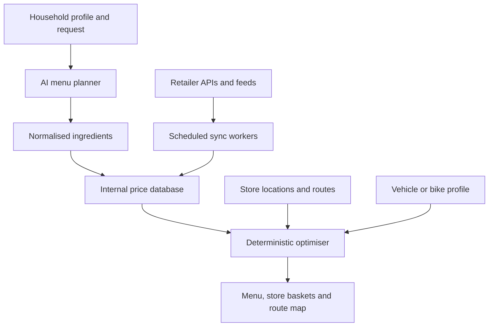

# SmartCart — developer handoff

## 1. What SmartCart is

SmartCart is not just a shopping list. Its core job is to answer:

> Given this household's diet, allergies, health goals, budget, available
> transport and nearby stores, what should they eat this week and where should
> they buy every ingredient for the lowest trustworthy total cost?

Total cost means groceries **plus** the cost of reaching the selected stores.
The result is a menu, consolidated ingredient list, store allocation, route map,
per-store shopping list, price provenance and a comparison of car versus bike.

## 2. First 30 minutes

Requirements: Node 20.9+, PostgreSQL and npm.

```bash
cp .env.example .env.local
npm install
npm run db:generate
npm run db:migrate -- --name initial
npm run dev
```

Open these routes in this order:

1. `/demo` — no credentials needed; verify the intended UX and optimiser.
2. `/signin` — configure Google OAuth.
3. `/` — existing collaborative shopping lists.

Run the complete gate before changing code:

```bash
npm run type-check && npm run lint && npm test && npm run build
```

## 3. Architecture at a glance



Code ownership:

| Concern | Primary files |
|---|---|
| Product demo and mobile UI | `components/planner/DemoPlanner.tsx`, `DemoPlanner.module.css`, `app/demo/page.tsx` |
| Interactive map | `components/planner/RouteMap.tsx` |
| Menu generation contract | `app/api/ai/menu-plan/route.ts` |
| Store discovery | `app/api/stores/nearby/route.ts` |
| Price reads | `lib/pricing/price-service.ts`, `app/api/prices/compare/route.ts` |
| Retail feed contract | `lib/pricing/provider.ts` |
| Optimisation | `lib/planning/optimise-shopping.ts`, `lib/planning/types.ts` |
| Routing | `app/api/routes/route/route.ts` |
| Data model | `prisma/schema.prisma` |
| Shared shopping lists | `app/api/lists/**`, `lib/pusher-client.ts`, `app/page.tsx` |

## 4. End-to-end flow

1. Read `UserProfile`: household size, diet, allergies, disliked foods, budget,
   store limit, radius and transport parameters.
2. Send the request plus relevant profile constraints to `/api/ai/menu-plan`.
3. Validate the returned schema. Persist `MealPlan`, days, meals and ingredients.
4. Aggregate equivalent ingredients using `normalizedKey`; convert compatible
   units before comparing products.
5. Discover nearby store branches. Persist/cross-reference them in `Store`.
6. Query **SmartCart's own** `StorePrice`/`Promotion` tables through
   `/api/prices/compare`. Do not call every retailer during a user request.
7. Run `/api/plans/optimize`. It evaluates store subsets, assigns each item to
   the cheapest usable offer, adds travel cost and rejects incomplete plans.
8. Request road geometry from `/api/routes/route` and display visits on the map.
9. Persist the selected `ShoppingPlan`, `StoreVisit` and allocations.

## 5. External services

| Service | Used for | Required for `/demo`? |
|---|---|---|
| PostgreSQL + Prisma | Persistent profiles, menus, prices and lists | No |
| Google OAuth + NextAuth | Accounts | No |
| Anthropic | Menu generation and ingredient extraction | No |
| Retail APIs/product feeds | Current prices and promotions | No; demo fixtures are bundled |
| openrouteservice | Road-following car/bike/walk routes | No; fallback line is labelled |
| Map tile provider | Basemap | Demo currently uses OSM standard tiles |
| Pusher | Real-time shared-list updates | No |
| Upstash | Rate limiting | No; local mode fails open |
| Resend | List invitation email | No |
| Stripe | Plans/billing | No |

## 6. Non-negotiable data rules

- Do not put retailer keys in client-side variables.
- Fetch retail data in scheduled server-side jobs and cache it locally.
- Never substitute an AI estimate when a price is missing.
- Display `fetchedAt`, `validUntil`, source and confidence.
- Ignore expired promotions in the optimiser.
- Clearly distinguish demo, estimated, stale, recent and verified data.
- Health constraints influence the menu before price optimisation; a cheaper
  product must never violate an allergy or hard dietary exclusion.

## 7. Recommended next implementation order

1. Choose one licensed retailer/aggregator feed and implement
   `RetailPriceProvider` end to end.
2. Add scheduled price/store sync with idempotent upserts and monitoring.
3. Persist the menu-plan response and connect it to the planner UI.
4. Add product matching: GTIN first, retailer SKU second, reviewed fuzzy match
   only as a fallback.
5. Replace demo store coordinates and prices in the signed-in flow.
6. Add a production map tile provider and route matrix optimisation.
7. Add end-to-end tests with a temporary PostgreSQL database.

## 8. Definition of production-ready

Do not call SmartCart production-ready until:

- at least the intended launch retailers have lawful, monitored data imports;
- price freshness and promotion validity are measurable;
- product/unit matching has a review path;
- allergy exclusions are tested as hard constraints;
- real route distances replace straight-line approximations in optimisation;
- GDPR consent, retention, deletion and data-processing agreements are done;
- billing, webhooks and rate limits are tested in the production environment;
- map tiles and routing usage comply with the chosen provider's terms.

